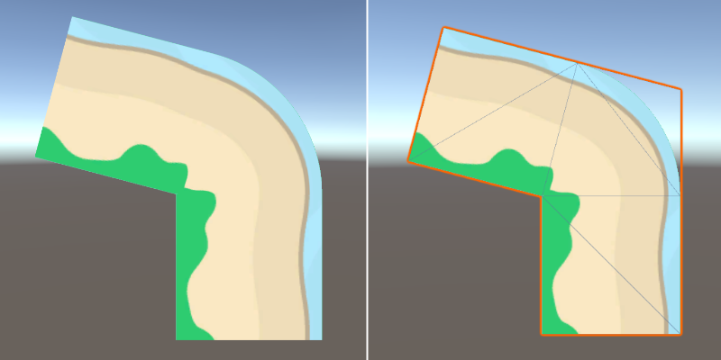

# Creating curved corner UVs in Unity

Read more: http://brookmiles.ca/2020/05/25/curving-corner-texture-uvs/

Files of particular interest:
- [CurvedUVStudy01/Assets/CurveTestMesh.cs](CurvedUVStudy01/Assets/CurveTestMesh.cs)
- [CurvedUVStudy01/Assets/CurveShader.shader](CurvedUVStudy01/Assets/CurveShader.shader)

